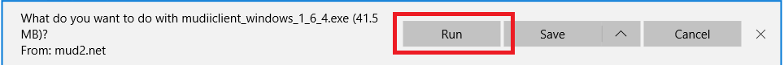
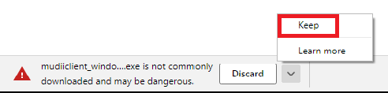
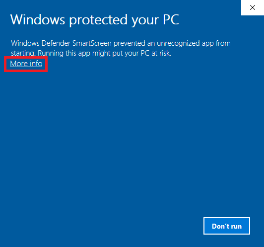
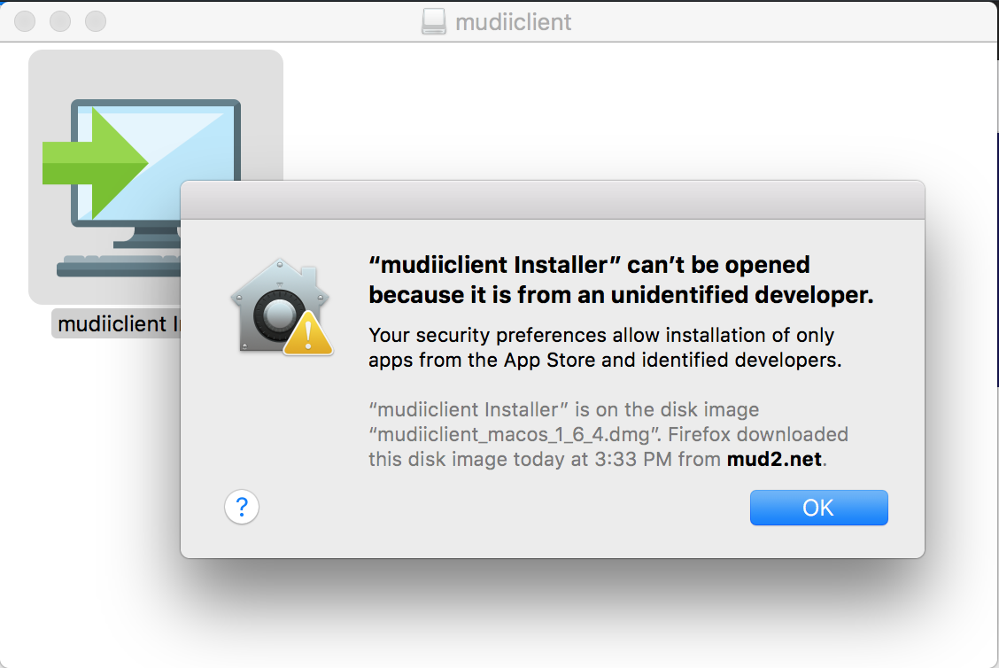
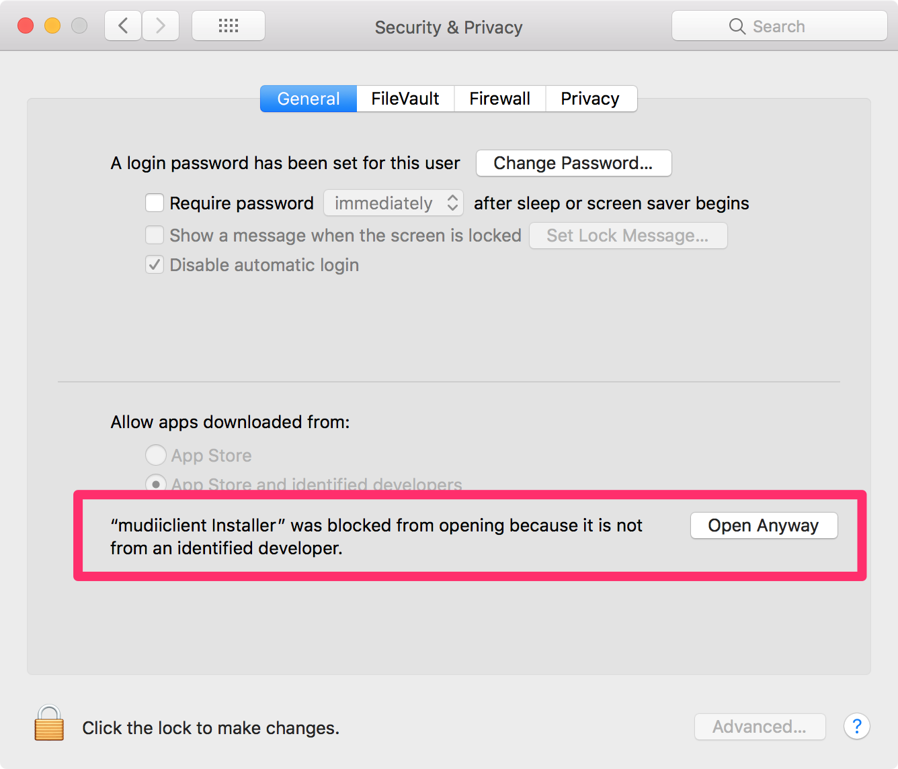
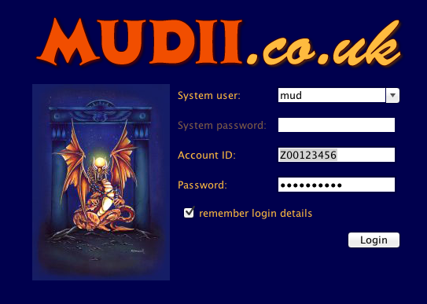

# What is this?

Mudiiclient is a MUD client specifically tailored to MUD2. It's super robust, blazingly fast, and has a streamlined interface that's entirely driven by the keyboard.

# Installation

Download the right installer for you, and then see notes below. I'm not paying fees to code sign the installer, so be ready for a ton of warnings.

* [Windows installer](mudiiclient_windows_1_6_4.exe) 43Mb (includes Java).
* [Mac OSX installer](mudiiclient_macos_1_6_4.dmg) 74Mb (includes Java).
* [Linux installer](mudiiclient_unix_1_6_4.sh) 2Mb (does not include Java - you need to install Oracle Java 1.6+ yourself).

## Windows installation notes

Depending on which browser you're using you may get different prompts and warnings. First, you'll be prompted whether to save or run the installer. Choose "Run". In Microsoft Edge on Windows 10, it ask something like this:

Your browser will likely warning you that the installer is dangerous. You'll want to select an equivalent option to "Keep this file". Firefox will say something like:

I didn't pay for a code-signing license for Windows, so Windows is going to warn you that the installer is dangerous. On Windows 10 you'll see a warning like this:

To get past it you need to click "More Info" and then click the "Run anyway" button.

## Mac OSX installation notes

I didn't pay for a code-signing license for Mac OSX, so OSX is going to warn you that the installer is dangerous. On Mac High Sierra you'll see a warning like this:

Click Okay to the warning, and the from the Apple menu on the top left of the screen, select "System Preferences". You'll see something like this:

Click "Security & Privacy". You'll see something like this:

Click the "Open Anyway" button.

# Usage

The first thing you'll see is a login screen:

* If you want to play as a guest select "mudguest" as the System User.
* Enter your Account ID and Password if you're playing using an account.
* Wizzes can change the System User and enter a System Password.

# Kudos to Install4j

Big thanks to Install4j for providing a free license for this app. Take a look, [Install4j is a multi-platform installer builder](https://www.ej-technologies.com/products/install4j/overview.html).

